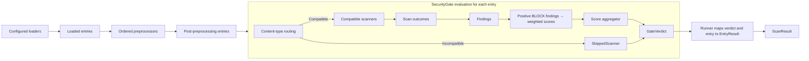
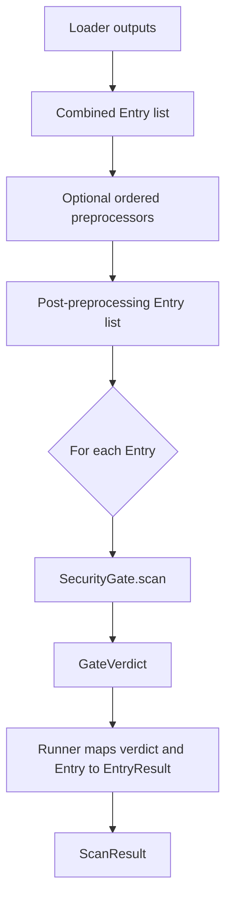
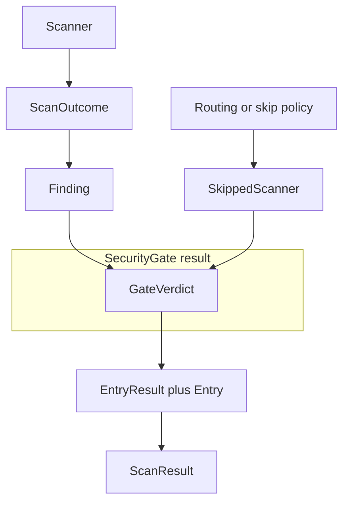

CerbIA evaluates loaded entries through a pipeline assembled by `Runner`. The
runner constructs configured components, applies preprocessors to the combined
loader output, sends each post-preprocessing entry through one `SecurityGate`,
and returns a `ScanResult`.

## Pipeline overview

## Construction and ownership

`Runner(CerbIAConfig)` owns pipeline assembly. It requires at least one loader
and scanner, builds component instances with `LoaderFactory`,
`PreprocessorFactory`, `ScannerFactory`, and `ScoreAggregatorFactory`, then
creates one `SecurityGate` from the configured scanners, score aggregator, and
gate settings.

Each component record supplies a fully-qualified class path and optional
`init_args`. Its factory imports the class, constructs it, and verifies that the
result satisfies the corresponding component contract. Factories construct
components; `Runner` owns their composition and execution order; `SecurityGate`
owns evaluation of one entry. See [Configuration](configuration.mdx) for the
record format.

## Entry lifecycle

During a scan, loaders run in configuration order and their returned entry lists
are combined. Each preprocessor receives the complete current list, and its
returned list becomes the input to the next preprocessor. `Runner` calls
`SecurityGate.scan()` once for every final, post-preprocessing entry.

### Entry derivation and cardinality

An `Entry` contains text, source, an optional field path, metadata, and a
content type. `Entry.derive()` preserves source, field path, content type, and
copied metadata; it records the original text once and appends the preprocessor
identifier to the derivation lineage.

Current built-in preprocessors preserve one output entry per input entry. The
preprocessor extension contract does not guarantee that cardinality: extensions
may transform, remove, reorder, or expand entries. Results therefore correspond
to post-preprocessing entries, not necessarily to the original loaded entries.
See [Loaders](components/loaders/index.mdx) and [Preprocessors](components/preprocessors/index.mdx)
for component-specific behavior.

## SecurityGate boundary

`SecurityGate` owns routing, scanner execution, finding creation, aggregation,
and one `GateVerdict`.

### Routing

Before invoking a scanner, the gate checks its accepted content types. A scanner
without a content-type restriction accepts every entry, and an entry with an
`unknown` content type is accepted by every scanner. A known incompatible type
does not invoke the scanner; the gate records a `SkippedScanner` instead.

### Scanning and findings

Compatible scanners run sequentially and return `ScanOutcome` values. The gate
enriches each outcome with scanner identity, severity, and action to create a
`Finding`. Scanner failures are a separate execution path rather than findings.

### Aggregation and verdicts

After scanning, the gate selects findings eligible for scoring, passes their
weighted scores to the configured score aggregator, and constructs a
`GateVerdict`. See [Gate behavior](gate.mdx) for action, threshold, fail-fast,
and scanner-error policy rules, and [Score aggregators](components/score-aggregators/index.mdx)
for aggregation strategies.

## Result hierarchy

| Layer | Cardinality | Responsibility |
| --- | --- | --- |
| `GateVerdict` | One per scanned entry | Gate safety, score, rationale, findings, and skipped scanners. |
| `EntryResult` | One per post-preprocessing entry | Associates the entry with its gate result. |
| `ScanResult` | One per runner scan | Collects entry results and computes summary fields. |

`ScanResult.is_safe` is true only when every entry result is safe.
`total_findings` and `unsafe_entries` summarize all entry results. A configured
loader can return no entries; in that case the gate is not called and the empty
`ScanResult` is safe with zero findings and unsafe entries. This does not relax
construction requirements for configured loaders and scanners.

## Shared URL registry

While constructing scanners, `Runner` creates one `UrlRegistry` for that runner
instance and offers it to scanner factories. A factory forwards it only when the
scanner constructor accepts `url_registry`. `UrlAllowlistScanner` registers its
configured allowlist patterns there, and URL-aware scanners can consult the
same live registry for the lifetime of that runner. Separate runners use separate registries;
this is neither global state nor a general dependency container.

See [Scanners](components/scanners/index.mdx) for scanner-specific URL behavior.

## Related documentation

- [Configuration](configuration.mdx)
- [Gate behavior](gate.mdx)
- [Loaders](components/loaders/index.mdx)
- [Preprocessors](components/preprocessors/index.mdx)
- [Scanners](components/scanners/index.mdx)
- [Score aggregators](components/score-aggregators/index.mdx)
- [Custom components](components/custom-components/index.mdx)
