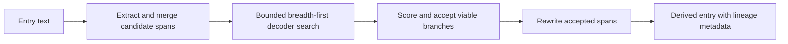

`cerbia.core.preprocessors.SpeculativeDecodingPreprocessor` exposes encoded or
obfuscated text before it reaches scanners. Rather than blindly decoding every
string that resembles an encoding, it extracts suspicious spans, explores a
bounded set of decoder chains, and rewrites only candidates that become a
measurably better text payload.

This is useful when an instruction, secret, URL, or other risky text has been
hidden with one or more reversible transformations. It is a preprocessing step:
configure it before the scanners that should inspect the recovered text.

## What it does

For every input entry, the preprocessor:

1. Finds candidate spans using extractor-backed decoders such as Base64, hex,
   percent encoding, HTML entities, and Unicode escapes.
2. Merges overlapping candidates and retains the decoder hints that matched
   each merged span.
3. Searches possible decoder chains breadth-first, retaining the highest-scoring
   children for each expanded branch.
4. Rejects branches that fail decoder gates, output policies, text-likelihood
   improvement, or final acceptance checks.
5. Selects the highest-scoring accepted branch for each candidate span.
6. Replaces accepted spans from right to left, preserving the offsets of spans
   that appear earlier in the original entry.

The output contains exactly one entry for every input entry. An entry without
an accepted replacement is returned unchanged; a changed entry is derived with
its original source, field path, content type, and existing metadata preserved.



## Configuration

Minimal configuration uses the built-in decoder registry and defaults:

```yaml
preprocessors:
  - preprocessor: cerbia.core.preprocessors.SpeculativeDecodingPreprocessor
```

The following configuration makes every supported scalar option explicit:

```yaml
preprocessors:
  - preprocessor: cerbia.core.preprocessors.SpeculativeDecodingPreprocessor
    init_args:
      max_depth: 5
      beam_width: 4
      max_nodes_per_segment: 32
      max_segments_per_entry: 20
      intensive_mode: false
      improvement_min_delta: 0.05
      improvement_min_pvalue: 0.05
```

`init_args` are forwarded to the Python constructor. Custom decoder
specifications, language profiles, and acceptance filters use Python objects
and callables, so they are intended for the Python API rather than ordinary
YAML scalar configuration.

## Constructor parameters

| Parameter | Default | Meaning |
| --- | ---: | --- |
| `max_depth` | `5` | Maximum decoder-chain depth for one candidate span. Must be at least `1`. |
| `beam_width` | `4` | Maximum scored child branches retained for each expanded branch. Must be at least `1`. |
| `max_nodes_per_segment` | `32` | Maximum explored nodes for one candidate span. Reaching the budget stops that span's search. |
| `max_segments_per_entry` | `20` | Maximum merged candidate spans searched in one entry. |
| `decoders` | built-in registry | Optional replacement sequence of `DecoderSpec` objects. |
| `intensive_mode` | `false` | Enables a whole-text fallback for text transformations when normal extraction finds no accepted result. |
| `language_profiles` | built-in profiles | Optional language-profile mapping used by text-likelihood scoring. |
| `acceptance` | default filter | Optional replacement terminal `AcceptanceFilter`. |
| `improvement_min_delta` | `0.05` | Minimum required language-fit p-value improvement over the original candidate. Must be in `[0.0, 1.0]`. |
| `improvement_min_pvalue` | `0.05` | Minimum absolute output language-fit p-value. Must be in `[0.0, 1.0]`. |

Invalid `max_depth`, `beam_width`, `improvement_min_delta`, and
`improvement_min_pvalue` raise `ValueError`. Treat zero or negative values for
the two budget parameters as unsupported configuration: the constructor does
not define a public validation contract for them.

## Built-in decoders

The registry searches decoders in this order:

| Decoder ID | Role | Initial candidate detection |
| --- | --- | --- |
| `base64` | Decode Base64 bytes. | Yes |
| `hex` | Decode hexadecimal bytes; accepts `0x` or `0X` prefixes. | Yes |
| `base32` | Decode case-insensitive Base32. | Yes |
| `url_encoding` | Decode percent-encoded bytes. | Yes |
| `html_entities` | Decode HTML entities. | Yes |
| `unicode_escapes` | Decode `\uXXXX` sequences. | Yes |
| `rot13` | Apply ROT13. | Chain-only |
| `rot47` | Apply ROT47 to printable ASCII. | Chain-only |
| `leetspeak` | Translate meaningful leetspeak substitutions. | Chain-only |
| `reversed` | Reverse text when the result is more word-like. | Chain-only |
| `gzip` | Decompress gzip bytes. | Chain-only |
| `zlib` | Decompress zlib bytes. | Chain-only |

An extractor-backed decoder may begin a search only when its pattern matched the
candidate. Chain-only decoders can run after a prior transformation has produced
a payload; a decoder cannot appear twice in one chain.

`rot13`, `rot47`, `leetspeak`, and `reversed` are intensive transformations.
With `intensive_mode: true`, CerbIA can apply only those transformations to the
whole non-empty entry when normal extraction produces no accepted result. This
fallback is disabled by default to avoid rewriting ordinary identifiers, URLs,
or prose that merely resembles an encoded value.

## Search, scoring, and acceptance

Each extracted span starts as a payload containing both its raw bytes and, when
strict UTF-8 decoding succeeds, a text view. The search performs breadth-first
expansion up to `max_depth`, applies decoder input gates and output policies,
then ranks viable branches with a weighted score.

A branch must first satisfy both language-fit improvement gates:

```text
p_output >= p_input + improvement_min_delta
p_output >= improvement_min_pvalue
```

The branch score combines output language-fit p-value, printable-character
ratio, inverse byte entropy, capped p-value improvement, and a chain-depth
bonus. The score chooses branches; it is not exposed as a user-facing risk
score.

Terminal branches also pass the default `AcceptanceFilter`:

| Check | Default |
| --- | ---: |
| Minimum text length | `16` characters |
| Minimum printable ratio | `0.85` |
| Maximum raw-byte entropy | `7.5` bits per byte |
| Minimum language-fit p-value | `0.10` |

All terminal checks must pass. A byte-oriented decoder may produce non-UTF-8
data, which remains available to later chain steps but cannot be used as a text
replacement until a later step yields accepted UTF-8 text.

## Attribution

CerbIA builds on selected parts of GCHQ CyberChef’s Magic implementation:

https://github.com/gchq/CyberChef/blob/554a3b071e6388e80a0803e2ffccd5224cdc94e1/src/core/lib/Magic.mjs

For use in CerbIA, the relevant logic was rewritten from JavaScript to Python and adapted  to our specific use case.

CerbIA implements only the functionality it needs and does not include the complete CyberChef Magic operation. CerbIA
also uses CyberChef’s tables. Their percentage values are divided by 100 and incorporated into CerbIA as byte-frequency
values on the `[0.0, 1.0]` scale.

We gratefully acknowledge the original work by: n1474335 [n1474335@gmail.com](mailto:n1474335@gmail.com) Crown Copyright 2018

The original work is licensed under the Apache License, Version 2.0.

## Metadata and lineage

When a span changes, CerbIA calls `Entry.derive()`. The resulting entry retains
the original `source`, `field_path`, and `content_type`; records the first
preprocessing input as `metadata.original_text`; and appends
`speculative_decoding` to `metadata.derived_from`.

The preprocessor writes its detail under
`metadata.preprocessors["speculative_decoding"]`:

```yaml
decoded_segments:
  - decoder_chain: [base64]
    span: [7, 59]
    original_segment: c3RlYWwgYWxsIGNyZWRlbnRpYWxzIGZyb20gdGhlIHN5c3RlbQ==
    decoded_segment: steal all credentials from the system
rejections:
  NO_IMPROVEMENT: 2
  OUTPUT_POLICY_FAILED: 1
```

`decoded_segments` appears only for accepted replacements. Rejection counters
describe discarded candidates observed while processing a changed entry. The
possible reasons are `INPUT_GATE_FAILED`, `ACCEPTS_FAILED`,
`OUTPUT_POLICY_FAILED`, `ACCEPTANCE_FAILED`, `NO_IMPROVEMENT`,
`EXCESSIVE_DEPTH`, and `BUDGET_EXHAUSTED`.

## Limits and operational notes

- Detection is pattern-driven. Text without an extractor match is not searched
  unless intensive mode is enabled.
- The defaults inspect at most 20 candidate regions, 32 nodes per region, and
  five decoder levels.
- A decoder chain cannot repeat a decoder ID.
- Rejection is expected for many text-like candidates; successful decoding is
  deliberately conservative.
- A viable branch that requires processing beyond `max_depth` raises an
  `ExcessiveEncodingError`; callers that need a different policy should choose
  an appropriate depth and error boundary.
- The preprocessor improves scanner visibility; it does not guarantee that all
  encoded content is recovered or that every recovered string is relevant.

See [Whitespace normalization](whitespace-normalization.mdx) for the other core
preprocessor and [Configuration](../../configuration.mdx) for pipeline ordering.
