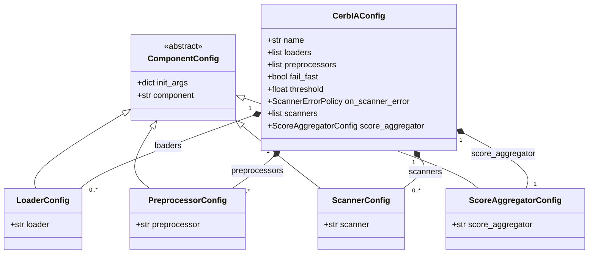

CerbIA reads one YAML mapping for one security gate. The root mapping is
validated as `CerbIAConfig`; component records then tell `Runner` which classes
to construct and how to initialize them.

## Configuration lifecycle

### Schema validation

The root model rejects unknown root keys and validates required fields, enum
values, and the `threshold` range. At this stage, component paths remain strings
and `init_args` is an arbitrary mapping. The schema permits empty `loaders` and
`scanners` lists so a configuration can be assembled incrementally.

### Component construction

`Runner` requires at least one loader and scanner. It imports every configured
class, passes its `init_args` as constructor keyword arguments, and verifies that
the resulting instance satisfies the expected component contract. Therefore, an
invalid import path or constructor argument can pass root-schema validation but
fail when the component is built.

`cerbia validate` performs both phases without loading entries or running
scanners.

## Root schema

| Key | Required | Default | Meaning |
| --- | --- | --- | --- |
| `name` | Yes | — | Human-readable pipeline identifier. |
| `loaders` | No in schema | `[]` | Ordered loader records; `Runner` requires at least one. |
| `preprocessors` | No | `[]` | Ordered transformation records. |
| `scanners` | No in schema | `[]` | Ordered scanner records; `Runner` requires at least one. |
| `score_aggregator` | Yes | — | Record selecting the score-combination strategy. |
| `fail_fast` | No | `true` | Stops after a qualifying blocking finding or blocking scanner failure. |
| `threshold` | No | `0.0` | Blocking-score threshold, inclusive from `0.0` through `1.0`. |
| `on_scanner_error` | No | `block` | Scanner failure policy: `fail`, `block`, or `skip`. |



## Component records

Every component record names an importable class using its collection's path key:

| Collection | Path key |
| --- | --- |
| `loaders` | `loader` |
| `preprocessors` | `preprocessor` |
| `scanners` | `scanner` |
| `score_aggregator` | `score_aggregator` |

### `init_args` contract

`init_args` is optional and defaults to `{}`. Its keys become keyword argument
names for the configured class constructor; its values are forwarded without
component-specific schema validation. Use the selected component's reference
page for accepted arguments, defaults, and validation rules.

```yaml
loaders:
  - loader: cerbia.core.loaders.FileLoader
    init_args:
      paths: ["src", "tests"]
      extensions: [".py", ".yaml"]
      recursive: true

scanners:
  - scanner: cerbia.core.scanners.KeywordScanner
    init_args:
      languages: ["en", "es"]
      match_strategy: all
      redact: true

score_aggregator:
  score_aggregator: cerbia.core.score_aggregators.MaxWithBonusScoreAggregator
  init_args:
    bonus: 0.05
```

Incorrect constructor names or values fail during component construction, not
when the root YAML mapping is parsed.

## Loaders

Loaders run in list order and their entries are combined. Use `TextLoader` for
inline values or `FileLoader` for paths and directories. See the
[loader reference](components/loaders/index.mdx) for details.

```yaml
loaders:
  - loader: cerbia.core.loaders.TextLoader
    init_args:
      texts:
        - "First value to scan"
        - "Second value to scan"

  - loader: cerbia.core.loaders.FileLoader
    init_args:
      paths: ["src"]
      extensions: [".py", ".md"]
      recursive: true
```

## Preprocessors

Preprocessors run in list order after loading and before gate evaluation. They
can transform entries or produce derived entries. See the
[preprocessor reference](components/preprocessors/index.mdx) for available components.

```yaml
preprocessors:
  - preprocessor: cerbia.core.preprocessors.WhitespaceNormalizationPreprocessor
    init_args:
      max_consecutive_spaces: 6
      max_consecutive_newlines: 6
```

## Scanners

Scanners run inside `SecurityGate`. Scanner options belong in `init_args` and
are specific to the configured scanner; see the [scanner reference](components/scanners/index.mdx)
before adding options.

```yaml
scanners:
  - scanner: cerbia.core.scanners.XssScanner
    init_args:
      html_context_aware: true
      content_types: [text, code]
```

## Content-type routing

`content_types` controls whether a scanner is eligible for an entry. Valid
values are `text`, `url`, `code`, and `unknown`.

| Condition | Result |
| --- | --- |
| Scanner `content_types` is `null` | Scanner accepts every content type. |
| Entry type is `unknown` | Every scanner accepts it. |
| A known entry type is listed in `content_types` | Scanner runs. |
| A known entry type is not listed | Scanner is skipped and recorded in the result. |

Routing controls scanner eligibility, not loader selection or preprocessing.
The core `TextLoader` and `FileLoader` currently produce entries with an
`unknown` content type, so scanner restrictions do not exclude their entries.

## Score aggregators

The score aggregator combines severity-weighted scores from positive `BLOCK`
findings. Choose one aggregator record and configure its options with
`init_args`; see [score aggregators](components/score-aggregators/index.mdx) for strategies.

```yaml
score_aggregator:
  score_aggregator: cerbia.core.score_aggregators.MaxWithBonusScoreAggregator
  init_args:
    bonus: 0.05
```

## Representative configuration

This illustrative configuration demonstrates every component-record type and
`init_args`. [examples/cli-usage/config.cerbia.yaml](../examples/cli-usage/config.cerbia.yaml)
remains the maintained executable repository example.

```yaml
name: documentation-example

fail_fast: false
threshold: 0.5
on_scanner_error: block

loaders:
  - loader: cerbia.core.loaders.TextLoader
    init_args:
      texts:
        - "A normal response"
        - "<script>alert('example')</script>"

preprocessors:
  - preprocessor: cerbia.core.preprocessors.WhitespaceNormalizationPreprocessor
    init_args:
      max_consecutive_spaces: 6
      max_consecutive_newlines: 6

scanners:
  - scanner: cerbia.core.scanners.XssScanner
    init_args:
      html_context_aware: true
      content_types: [text, code]

  - scanner: cerbia.core.scanners.SecretScanner
    init_args:
      entropy_detection: true
      content_types: null

score_aggregator:
  score_aggregator: cerbia.core.score_aggregators.MaxWithBonusScoreAggregator
  init_args:
    bonus: 0.05
```

## Execution policies

Only positive `BLOCK` findings contribute severity-weighted scores to the
aggregator. An entry is unsafe when the aggregate reaches or exceeds
`threshold`; with `threshold: 0.0`, any positive blocking finding makes the
entry unsafe. `fail_fast: true` stops after an individual blocking finding
reaches the threshold.

`on_scanner_error` controls exceptions raised by scanners:

| Value | Result |
| --- | --- |
| `fail` | Propagates the scanner error. |
| `block` | Marks the entry unsafe and records a scanner-failure rationale. |
| `skip` | Records the scanner as skipped and continues. |

See [Gate behavior](gate.mdx) for verdict rules.

## Validate configuration

Validate YAML before scanning:

```bash
cerbia validate examples/cli-usage/config.cerbia.yaml
```

A successful command means the YAML mapping and root schema are valid, required
runtime loader and scanner presence is checked, component paths can be imported,
constructors accept their arguments, and the resulting objects satisfy their
expected contracts. It does not load entries or run scanners.

## Related references

See [Architecture](architecture.mdx), [Gate behavior](gate.mdx), and
[Packages](packages/index.mdx) for pipeline and package details. See
[Custom components](components/custom-components/index.mdx) to configure externally provided
loaders, preprocessors, scanners, and score aggregators.
