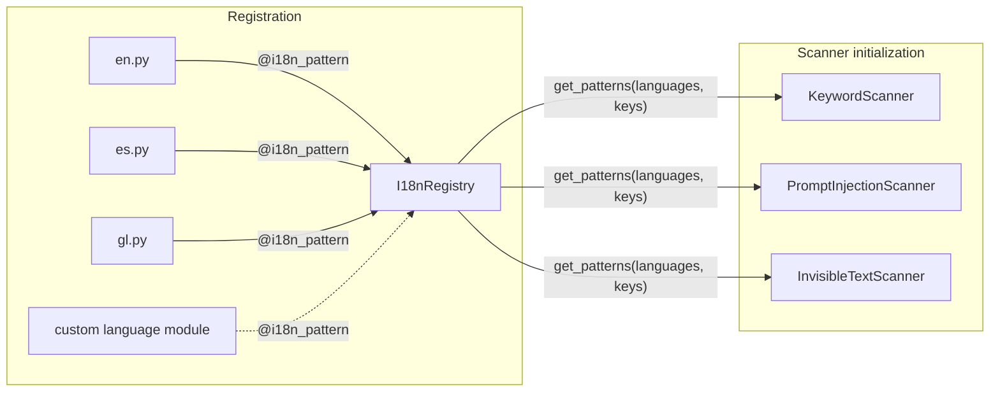

CerbIA's i18n system is a registry of compiled, case-insensitive regular
expressions indexed by language-code and category-key strings. Built-in packs
use ISO-639-1 codes and currently provide English (`en`), Spanish (`es`), and
Galician (`gl`). Consumers request the keys they need and receive patterns from
the selected language packs.

Language packs may provide a subset of categories. Missing categories and
unknown language codes contribute no patterns, so validate a deployment's
selected languages and required categories with the registry introspection API.

## Architecture



## Registry and category contract

`cerbia.core.i18n.get_patterns()` returns compiled expressions grouped by
category key. With no filters, it merges every registered language and key;
`languages` and `keys` limit that merge. Repeated registrations for the same
language and key append patterns rather than replacing earlier ones.

```python
from cerbia.core.i18n import get_patterns
from cerbia.core.registries import i18n_registry

patterns = get_patterns(
    languages=["en", "es"],
    keys=["instruction_override", "exfiltration"],
)

available_languages = i18n_registry.available_languages()
available_keys = i18n_registry.available_keys()
```

Use `has_language(code)` and `has_key(key)` as global registry checks. To
verify coverage for a particular language and category selection, call
`get_patterns(languages=[...], keys=[...])` and inspect the result. The registry
does not validate language codes or category semantics, and does not require
every language pack to implement every category.

### Built-in category inventory

This is the current built-in inventory, not a closed registry enum. Category
keys express the kind of text a pattern represents; consumers decide how to
interpret matching patterns.

| Category key | Semantic role |
| --- | --- |
| `instruction_override` | Attempts to replace, ignore, or supersede instructions. |
| `exfiltration` | Attempts to reveal protected instructions or send data elsewhere. |
| `role_hijack` | Attempts to redefine the model, user, or system role. |
| `context_manipulation` | Prompt or chat-template markers intended to alter context. |
| `privilege_escalation` | Attempts to obtain elevated access or bypass restrictions. |
| `fake_authority` | Claims of authority intended to gain trust or special treatment. |
| `task_deflection` | Attempts to reset, replace, or divert the current task or context. |
| `keyword_instruction_override` | Short keyword-oriented instruction-override indicators. |
| `keyword_system_prompt` | References to system, hidden, or original prompts and instructions. |
| `keyword_exfiltration` | Short keyword-oriented indicators of protected-data disclosure. |
| `keyword_instruction_manipulation` | Keywords associated with instruction manipulation or evasion. |
| `keyword_suspicious_keywords` | General suspicious keywords, including environment-file references. |
| `defensive_context` | Phrases that indicate a defensive or explanatory context near a match. |

## Integrating a consumer

Consumers select the languages and category keys relevant to their purpose,
then receive a mapping from each selected key to compiled patterns. They must
handle an empty mapping because a language or category may be unknown or not
covered by a selected pack.

```python
from cerbia.core.i18n import get_patterns

patterns_by_category = get_patterns(
    languages=["en", "es"],
    keys=["instruction_override", "exfiltration"],
)
```

Consumer-specific matching, scoring, normalization, and fallback behavior are
documented with each consumer rather than defined by the registry. For an
example of language selection in configuration, see the
[Keyword scanner](components/scanners/keyword.mdx) and [Prompt injection scanner](components/scanners/prompt-injection.mdx).

## Adding a language pack

1. Choose an ISO-639-1 language code and create a module under
   `cerbia.core.i18n`, such as `fr.py`.
2. Add decorated, zero-argument functions for the categories the pack covers.
   Each function returns raw regular-expression strings.
3. Import the module from `cerbia.core.i18n.__init__` so that registration runs
   when the package initializes.
4. Confirm registration with `available_languages()`, `available_keys()`,
   `has_language()`, and `has_key()`.
5. Add tests for intended matches, expected non-matches, language selection,
   and relevant defensive-context false positives.

```python
from cerbia.core.registries import i18n_pattern


@i18n_pattern("fr", "instruction_override")
def french_instruction_overrides() -> list[str]:
    return [r"ignorez\s+les\s+instructions"]
```

Partial coverage is supported: a missing category contributes no patterns.
Prefer documenting intentional gaps to adding weak expressions merely for
symmetry with another language pack.

## Authoring patterns

Use raw Python strings for expressions. `@i18n_pattern` compiles every returned
pattern with `re.IGNORECASE` at import time, so invalid regular expressions
prevent the pack from loading.

- Use word boundaries and constrained whitespace deliberately.
- Cover relevant casing, punctuation, Unicode forms, accents, inflections, and
  synonyms for the language.
- Avoid overly broad alternatives that increase false positives.
- Include positive and negative test cases for every non-trivial expression.
- Add `defensive_context` patterns only for phrases that genuinely indicate a
  defensive or explanatory use near a potential match.
